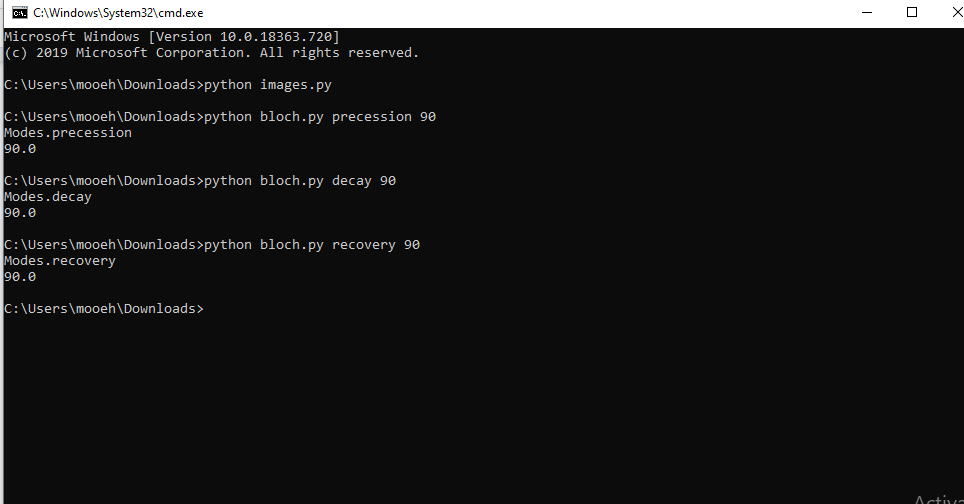
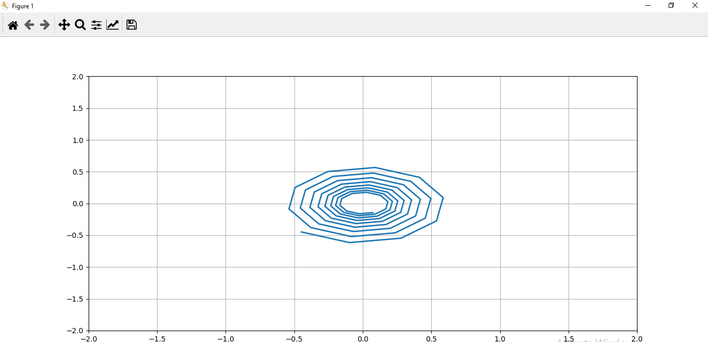
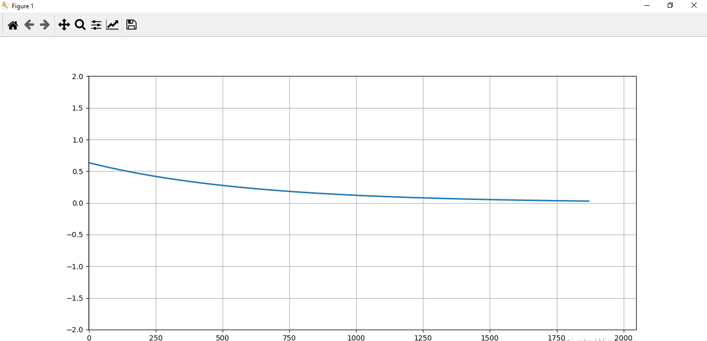
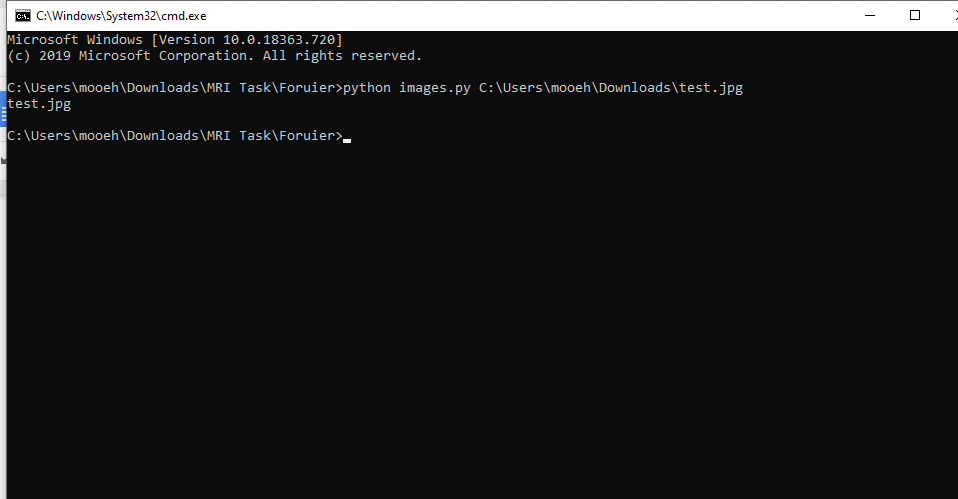
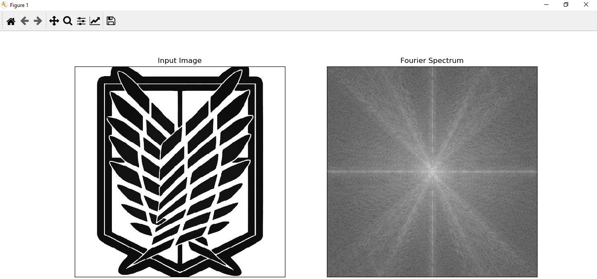
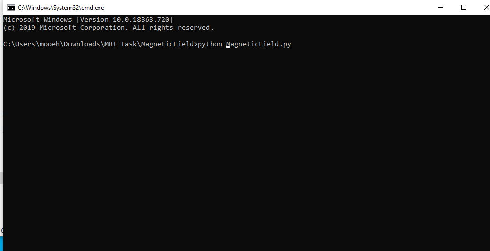

* # How to run the code
* ## Task 1 MRI

* # Abstract:
    In this report i will discuss how to run the code correctly.
* # What to write in the terminal:

    * ## To run one of the three modes (Precession/ Decay/ Recovery):
		* ## Run "bloch.py" file 
			* ### Passing 2 more arguments: 
				- 1)Name of one of the 3 modes.
				- 2)Flip angle Value. 
		
    	* ## you will get one of those three results:
		* ### Precession:
		
		* ### Decay:
		
		* ### Recovery:
		

   * ## To run The fourier transform function on an image:
		* ## Run "Images.py" file
			* ### Passing one more argument: -Path of the Image.
		
   
    		* ## you will get result like this:
		

   * ## To run The function that shows the non-Uniformity of the magnetic field:
		* ## Run "MagneticField.py" file from (Magnetic Field) folder:
		
    		* ## you will get result like this:
		
